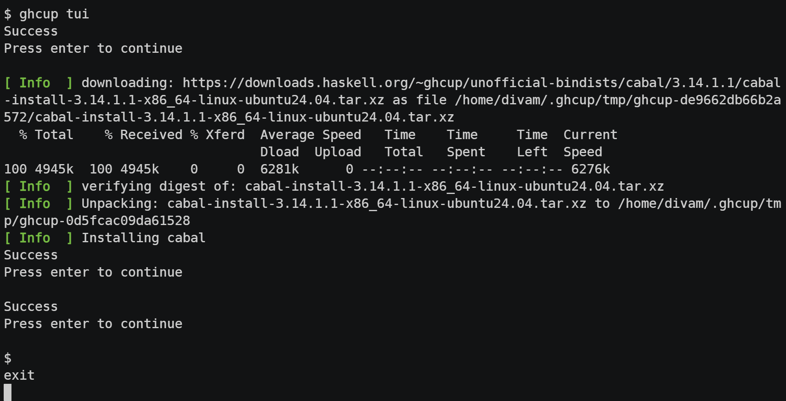
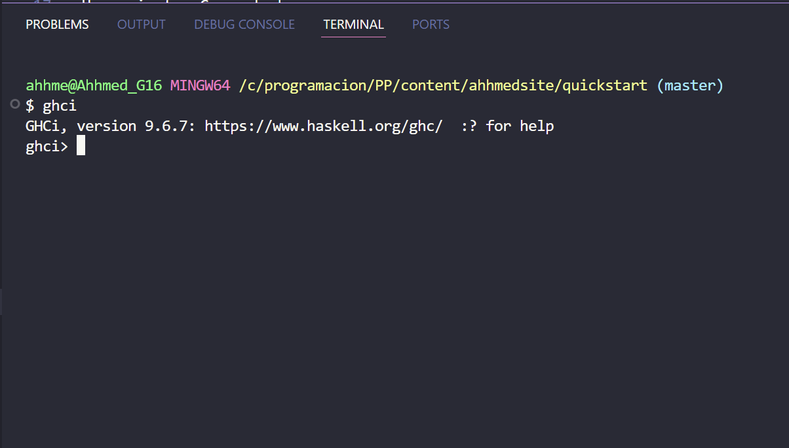
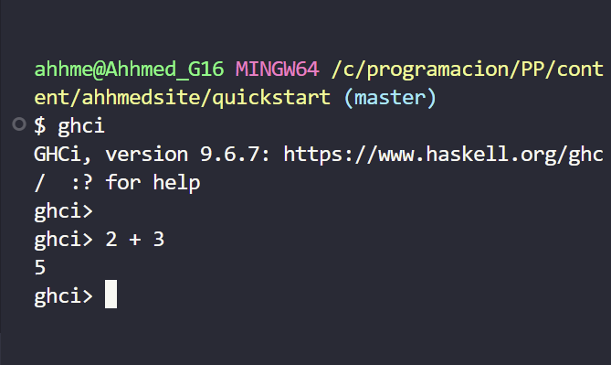
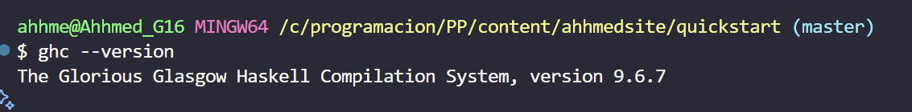
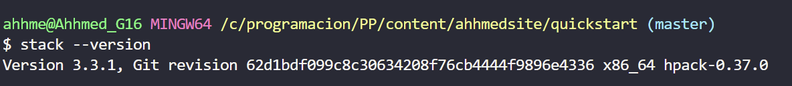

+++
date = '2025-09-26T10:23:55-07:00'
draft = false
title = 'Practica 3'
+++

# Instalación del Entorno de Desarrollo de Haskell
## FACULTAD DE INGENIERÍA, ARQUITECTURA Y DISEÑO
### Descargar haskell

- Primero vamos a la pagina de haskell y nos vamos a descargas
- Descargamos GHCup
Imágenes: .

1. Verificación y Prueba de la Instalación
Después de completar la instalación del entorno de Haskell, se realizó una serie de pasos para comprobar la funcionalidad de todas las herramientas clave, siguiendo la guía Get Started oficial.
Imágenes: .

Herramientas Comprobadas
Verificación del Compilador (GHC): Se confirmó que el Glasgow Haskell Compiler (GHC) se instaló correctamente ejecutando el comando de versión.

Bash

ghc --version
Prueba del Intérprete Interactivo: Se inició la sesión interactiva de GHC para realizar cálculos sencillos, verificando su respuesta.
Imágenes: .

Bash

ghc
Dentro del intérprete (probado desde VS Code):

Haskell

2 + 3
Verificación de Stack: Se comprobó que la herramienta de gestión de proyectos y paquetes (Stack) estaba operativa.
Imágenes: .

Bash

stack --version
Ejecución de un Programa Básico: Finalmente, se creó y ejecutó un programa simple para asegurar la correcta compilación de archivos .hs.
Imágenes: .

Archivo hello.hs:

Haskell

main = do
  putStrLn "Hello, everybody!"
  putStrLn ("Please look at my favorite odd numbers: " ++ show (filter odd [10..20]))
Comando de Ejecución:

Bash

ghc hello.hs
2. Proceso de Instalación del Entorno de Haskell
Esta sección detalla los pasos seguidos para configurar el entorno de desarrollo de Haskell en el sistema operativo Windows utilizando la herramienta recomendada.

Introducción
El proceso se centró en utilizar GHCup, el instalador universal recomendado, para asegurar que todas las herramientas necesarias de Haskell se descargaran e instalaran de manera unificada.

Uso de GHCup mediante PowerShell
Acceso y Selección: Se accedió a la página oficial de Haskell, donde se indicó que GHCup era el método de instalación preferido. Posteriormente, se navegó a la página de GHCup y se seleccionó la opción de instalación para Windows.

Ejecución: Se copió y se ejecutó el comando de descarga para PowerShell dentro de la ventana del terminal.

Configuración: Se siguió el instalador interactivo, aceptando las configuraciones predeterminadas para instalar el compilador GHC, la herramienta Stack, y otras utilidades esenciales.

Con la finalización de estos pasos, se completó la descarga e instalación de todo el toolkit del entorno Haskell.

3. Conclusiones
La instalación del toolchain de Haskell se simplificó enormemente gracias al uso de GHCup, permitiendo una configuración ágil desde un solo comando en PowerShell. La guía oficial Get Started resultó fundamental para verificar rápidamente que todos los componentes clave estaban funcionales y listos para el desarrollo.

[Portafolio](https://github.com/AHHMED-J/Portafolio-376285)

