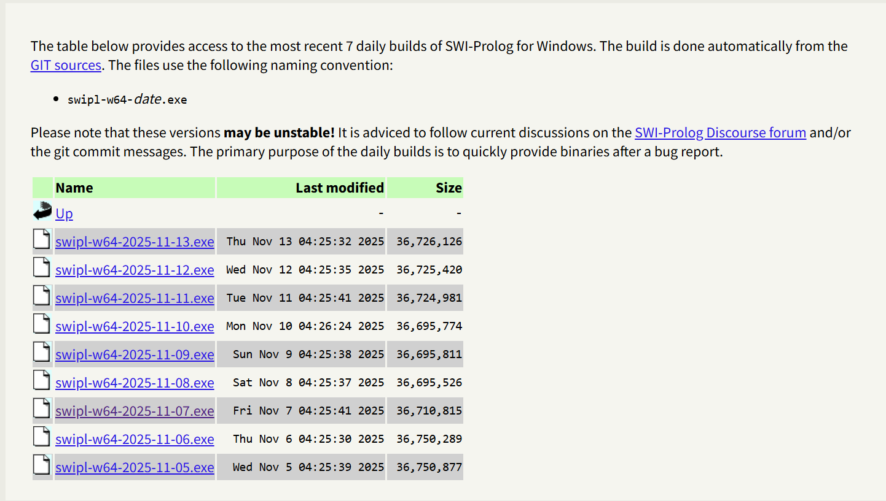
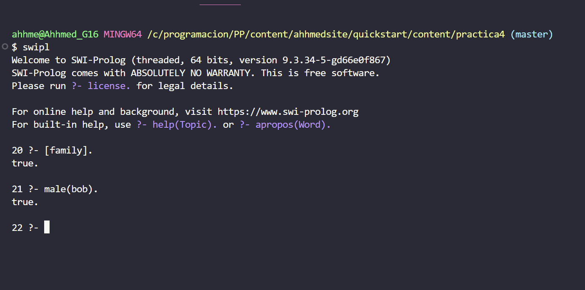

+++
date = '2025-09-26T10:23:55-07:00'
draft = false
title = 'Practica 4'
+++

# Instalación del Entorno de Desarrollo de Haskell
## FACULTAD DE INGENIERÍA, ARQUITECTURA Y DISEÑO

### Instalación del entorno de desarrollo e introducción a Prolog

Descargar SWI-prolog
Imágenes: .

SWI prolog es la implementación más popular y ampliamente utilizada del lenguaje Prolog en el mundo. No es solo el lenguaje en sí, sino un sistema que te permite escribir, compilar, ejecutar y depurar código Prolog.

El SWI-Prolog es un entorno de desarrollo completo para el lenguaje de programación Prolog.En términos sencillos, es la implementación más popular y ampliamente utilizada del lenguaje Prolog en el mundo. No es solo el lenguaje en sí, sino un sistema que te permite escribir, compilar, ejecutar y depurar código Prolog. 

Características Clave de SWI-PrologCaracterísticaDescripciónLenguaje BaseImplementa el lenguaje Prolog, que se basa en la lógica de primer orden. Es un lenguaje declarativo, lo que significa que describes el problema y las relaciones entre los datos, en lugar de describir paso a paso cómo resolverlo (como en lenguajes imperativos como C++ o Python).Código Abierto (Open Source)Es un proyecto de código abierto y gratuito, lo que ha contribuido a su gran base de usuarios y su constante desarrollo.

Entorno RicoOfrece más que solo el intérprete. Incluye herramientas como un depurador (debugger), un módulo de prueba unitaria, un servidor HTTP integrado, y soporte para generar gráficos.ExtensibilidadEs conocido por su facilidad para integrarse con otros sistemas, particularmente a través de su interfaz de función externa (Foreign Function Interface - FFI), que permite a Prolog llamar a código escrito en C/C++ u otros lenguajes.

AplicacionesSe usa en Inteligencia Artificial (IA), procesamiento de lenguaje natural (NLP), sistemas expertos, y en aplicaciones que requieren razonamiento lógico y manipulación de datos simbólicos.

 ¿Para qué se utiliza Prolog? Prolog, y específicamente SWI-Prolog, es ideal para problemas donde la lógica de las relaciones es más importante que los cálculos complejos.Sistemas de Reglas y Sistemas Expertos: 
 - Crear programas que emulen el proceso de toma de decisiones de un experto humano.
 - Análisis Gramatical: Describir y analizar la estructura de frases en lenguajes humanos.
 
 Bases de Datos Lógicas: 
 - Consultar datos y sus relaciones complejas.

 ### Ejemplo en Prolog

Aqui tenemos un ejemplo donde primero asignamos una base de datos en family.pl y despues preguntamos si bob es hombre
 Imágenes: .

[Portafolio](https://github.com/AHHMED-J/Portafolio-376285)
